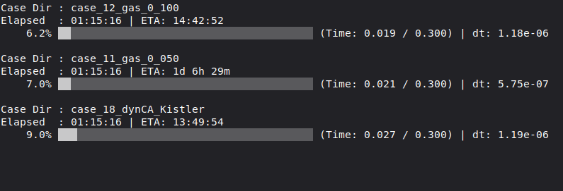

# foam-run-monitor

Command-line utilities for running, monitoring, reconstructing, and visualizing OpenFOAM® simulations.

The repository contains three scripts:

- `runCase` runs a single case or manages a batch of cases.
- `monitorCase` finds active OpenFOAM processes and reports their progress.
- `animateCase` renders one or more cases as ParaView animations.

## Contents

- [Requirements](#requirements)
- [Installation](#installation)
- [runCase](#runcase)
- [monitorCase](#monitorcase)
- [animateCase](#animatecase)
- [How the scripts work together](#how-the-scripts-work-together)

## Requirements

### OpenFOAM tools

Load a working OpenFOAM environment before using `runCase`. Depending on the case and selected mode, the script calls:

- the solver named by `application` in `system/controlDict`
- `checkMesh`
- `foamListTimes` and `foamDictionary`
- `setFields`
- `decomposePar`
- `reconstructPar` and, for dynamic meshes, `reconstructParMesh`
- `mpirun` for parallel cases

`runCase` treats a case as parallel when `system/decomposeParDict` exists and its `numberOfSubdomains` value is greater than one.

### Python and Linux

`runCase` requires Python 3.9+ and Linux `flock` (util-linux). `monitorCase` and `animateCase` also require Python 3. `monitorCase` discovers processes through Linux's `/proc` filesystem, so it is intended for Linux systems and can only inspect processes that the current user is permitted to read.

### ParaView

`animateCase` requires ParaView's `pvpython`. The script searches `PATH` and several common installation directories. Rendering also requires a working graphical or headless ParaView environment.

## Installation

Make the scripts executable:

```bash
chmod +x runCase monitorCase animateCase
```

Either call them by their full paths or add this repository to your `PATH`. For example:

```bash
export PATH="$PATH:/path/to/foam-run-monitor"
```

If you use Bash, add that `export` line to `~/.bashrc` so it persists between terminal sessions. Then open a new terminal or reload the file:

```bash
source ~/.bashrc
```

## runCase

`runCase` coordinates the normal OpenFOAM case lifecycle: optional cleanup, mesh checking, decomposition, solver execution, progress reporting, reconstruction, and optional animation rendering.

Run it inside a case directory containing `system/controlDict`, or give it one or more case or parent directories to use batch mode.

```bash
runCase MODE [OPTIONS] [CASE_OR_PARENT ...]
```

### Execution sequence

For a normal new or continued run, the sequence is:

1. Determine whether this is a single-case or batch run and locate the target cases.
2. Read `controlDict` and, if present, `decomposeParDict` and default- or region-level `dynamicMeshDict` files to identify the solver, end time, processor count, and mesh type.
3. Validate the case, acquire a case lock, and run a fresh mesh check. Continued parallel cases check the processor mesh at the latest time; fresh runs check time zero.
4. In new mode, ask before deleting existing results, then clean the case, restore `0` from `0.orig` when available, and run `setFields` when `system/setFieldsDict` exists.
5. For a parallel case, run `decomposePar` if processor data does not already exist.
6. Start the solver and display its progress until it finishes.
7. For a parallel case, reconstruct the mesh when necessary, reconstruct the results, verify the reconstructed data, and only then remove processor data.
8. If `--animate` was requested, call `animateCase` to render the result.

Reconstruction mode skips solver execution and goes directly to step 7. Clean mode performs only the cleaning actions from step 4.

### Modes

Choose one mode for each invocation:

| Mode | Behavior |
| --- | --- |
| `-n`, `--new` | Starts a fresh simulation. If old results are detected, asks before removing them. Removes time directories and decomposed data, restores `0` from `0.orig` when available, and runs `setFields` if configured. |
| `-c`, `--continue` | Runs the solver without deleting existing results. Requires `startFrom latestTime`, consistent processor times/ranks, initialized restart fields, and an `endTime` later than the restart time. Invalid continuation fails before mutation. |
| `-r`, `--reconstruct` | Reconstructs an existing parallel case without running the solver. |
| `-clean`, `--clean` | Confirms cleanup (or requires `--allow-clean` in non-interactive mode), restores `0` from `0.orig` when available, and runs `setFields` if configured, but does not start the solver. |

New and clean modes retain `log/log.checkMesh` while removing other files under `log/`.

### Options

| Option | Behavior |
| --- | --- |
| `-np N`, `--np N` | Sets `numberOfSubdomains` to `N` in `system/decomposeParDict`. This is the number of MPI ranks used **per case**. |
| `-b`, `--batch` | Explicitly enables batch discovery. |
| `-P N`, `--jobs N` | Runs up to `N` cases concurrently in batch mode. The default is one case at a time. |
| `-q`, `--quiet` | Hides live progress displays and spinners. Commands still run, confirmation prompts still appear, and `--animate` still renders when requested. |
| `-k`, `--keep-processors` | Keeps decomposed processor data after reconstruction, even when reconstruction verification succeeds. |
| `-a`, `--animate` | Calls `animateCase` after a successful single-case run or after the batch manager finishes. |
| `-s FILE`, `--state FILE` | Passes a ParaView state file to `animateCase`; meaningful with `--animate`. |
| `--fps N` | Passes the animation frame rate to `animateCase`. |
| `--res W H` | Passes the animation resolution to `animateCase`. |
| `--field NAME` | Passes the field selection to `animateCase` when no state file is used. |
| `--non-interactive` | Never prompts; missing cleanup approval fails immediately. Ordinary batch execution proceeds without a final question. |
| `--allow-clean` | Explicitly approves destructive cleanup in `--new` or `--clean` mode only. |
| `--plan`, `--dry-run` | Validates and prints intended actions without changing files, running mesh checks, or starting solvers. |
| `--format=json` | Emits a JSON plan, or one JSON object per line for batch plans. Requires `--plan`. |
| `--version`, `--capabilities` | Reports script/interface versions or JSON automation capabilities and exit codes. |
| `-h`, `--help` | Shows command-line help. |

`-np` and `-P` control different forms of parallelism. For example, the following runs two cases at once, with eight MPI ranks assigned to each case:

```bash
runCase --new -np 8 -P 2 case1 case2 case3
```

### Automation interface (version 1)

```bash
runCase --continue --plan --format=json
runCase --continue --non-interactive --quiet
runCase --new --non-interactive --allow-clean --quiet
runCase --version
runCase --capabilities
```

Plans report solver, ranks, restart/end times, decomposition, reconstruction,
cleanup, required approval, and lock availability. A plan with
`requiresConfirmation: true` describes a valid operation that still needs
explicit cleanup approval; it does not grant that approval. Batch JSON plans
are JSON Lines (one object per discovered case). Errors go to stderr as
`RUNCASE_ERROR=NAME: explanation`; case-validation failures in JSON plan mode
also produce a JSON error object. Plans never apply `--np` or acquire a durable
lock, and do not perform mesh or solver checks.

Dictionary queries disable OpenFOAM function entries to keep planning free of
side effects. Values supplied only through `#include`, `#calc`, `#codeStream`,
or other unresolved directives must be resolved before using this interface.
Continuation conservatively checks the field inventory from `0`, `0.orig`,
and processor `0` directories; it cannot infer arbitrary solver-specific
requirements. Missing initial inventories fail explicitly. Restart field
headers and filenames are checked, not every field's numerical contents.
Uncollated `processor0..N-1` and single `processorsN` collated layouts are
supported for continuation; split/legacy collated layouts fail for review.

A case-local kernel lock at `.runCase/lock` prevents concurrent **runCase**
invocations. It does not discover solvers launched through other tools, so
check those separately. Keep the lock file in place: the kernel releases
ownership automatically on exit, so a stale file is safe to reuse. The small,
atomically replaced `.runCase/last-run.json` receipt records the process,
hostname, command, start/update timestamps, solver, ranks, restart time,
log path, completion state and exit status. A receipt left as `running`
after a forced kill is historical evidence, not proof that a process is alive.
The receipt is written only after a launch owns the lock; rejected preflight
attempts preserve the preceding receipt.

| Status | Meaning |
| ---: | --- |
| 0 | Success |
| 2 | Invalid arguments |
| 10 | Confirmation needed, declined, or unavailable |
| 11 | Cleanup approval required / queued data appeared |
| 12 | Invalid continuation |
| 13 | Case lock already held |
| 14 | Invalid decomposition or failed decomposition command |
| 15 | Missing environment, invalid case/dictionary, preparation or animation failure |
| 20 | Mesh check failed |
| 30 | Solver failed (underlying status appears in the error) |
| 40 | Reconstruction, verification, or verified cleanup failed |
| 50 | One or more batch jobs / batch animation failed |
| 130 / 143 | Active single-case child interrupted by SIGINT / SIGTERM |

Use `--non-interactive` for unattended batch runs. Multi-case `--animate`
still needs the separate renderer's confirmation and is rejected up front in
non-interactive mode; render separately. `--jobs` counts cases, not cores:
choose concurrency from each case's rank count. For a 14-core budget, two
8-rank jobs must run sequentially. The script remains a foreground command;
a service manager can own it for persistent unattended execution.

### Single-case execution

Start a case from scratch on eight MPI ranks:

```bash
cd /path/to/case
runCase --new -np 8
```

During execution, the display shows case configuration, simulation progress, the current and saved time, timestep size, Courant numbers, iteration speed, elapsed time, and estimated time remaining. Dynamic-mesh cases also show the latest detected cell count.


### Mesh checking

Before each solver run, `runCase` checks the current mesh and replaces `log/log.checkMesh`. Fresh runs check time zero. Continuations check `-latestTime`, using `mpirun ... checkMesh -parallel` when processor storage exists. Multi-region cases request `-allRegions`. A failed command or missing `Mesh OK` result stops execution with status 20; cached success never bypasses this check.

### Parallel execution and reconstruction

For a parallel case, `runCase`:

1. Runs `decomposePar` when no recognized processor storage exists, adding `-latestTime` for continuation. Existing storage must match the configured ranks.
2. Starts the solver with `mpirun -np N ... -parallel`.
3. Runs `reconstructParMesh` first when a non-static `dynamicFvMesh` is detected, including region-level dynamic mesh dictionaries.
4. Reconstructs every region in a multi-region case when the installed OpenFOAM tools support it.
5. Runs `reconstructPar` and verifies the reconstructed data.
6. Removes processor directories only when every verification layer succeeds.

If reconstruction fails or the installed OpenFOAM version cannot safely reconstruct or verify every region, the processor data is preserved and the relevant reconstruction log is reported.

### Cleanup and reconstruction safety

New-mode confirmation uses `foamListTimes`, so signed, decimal, and scientific-notation time directories are detected consistently with OpenFOAM. Batch deletion approval applies only to the cases named in the warning; if data appears in another case while it is queued, that case stops without deleting anything.

`--new` asks for confirmation when existing results are found; `--clean` always asks. `--non-interactive` turns required approval into an immediate error. Add `--allow-clean` only when deletion is intended. `--quiet` suppresses the display and never approves deletion. The legacy private `--force-new` alias remains an explicit cleanup approval for compatibility.

Cleanup removes only recognized OpenFOAM processor names, such as `processor0` or collated `processors8`, and leaves similarly named paths such as `processorBackup`, `processor0.old`, and `processors_archive` untouched.

After reconstruction, `runCase` compares processor and reconstructed time/object manifests, checks file headers and refreshed outputs, and asks `checkMesh` to read the latest reconstructed mesh. Multi-region verification uses `checkMesh -allRegions` where available and falls back to checking each region separately for versions such as OpenFOAM Foundation v10. Processor storage is deleted only after all checks succeed. Use `--keep-processors` to retain it unconditionally.

### Batch execution

Batch mode is enabled when:

- one or more case or parent directories are supplied as positional arguments;
- `-P` or `--jobs` is supplied; or
- `runCase` is launched from a directory that does not contain `system/controlDict`.

A supplied case directory is queued directly. A supplied parent directory is searched for cases containing `system/controlDict`; the current implementation recognizes cases within two nested directory levels. Duplicate paths are removed before execution.

For example, consider a study directory with the following layout:

```text
study/
├── case_01/
│   └── system/controlDict
├── case_02/
│   └── system/controlDict
└── variants/
    └── case_03/
        └── system/controlDict
```

Running the following from `study/` automatically searches the current directory, discovers all three cases, and queues them without requiring the case names individually:

```bash
cd /path/to/study
runCase --new -P 2
```

You can also pass the parent directory explicitly from somewhere else:

```bash
runCase --continue -P 2 /path/to/study
```

In both examples, `-P 2` allows two discovered cases to run concurrently. The search happens automatically; shell wildcards are optional.

Run three selected cases, two at a time:

```bash
runCase --new -P 2 case1 case3 case4
```

Use shell expansion to select cases:

```bash
runCase --continue -P 3 case_*
```

The batch manager asks for confirmation unless `--non-interactive` was supplied, then displays whether each case is queued, running, done, or crashed. In new mode, cleanup approval is tracked per case rather than applied to the entire queue.


To run a complete batch and render the cases afterward:

```bash
runCase --new -np 3 -P 2 --animate --fps 5 --state setup.pvsm
```

In this example, each case uses three MPI ranks, at most two cases run concurrently, and `animateCase` uses two concurrent rendering jobs after the simulations finish.

When `--animate` is used in batch mode, `runCase` attempts to render every case, including cases marked as crashed. A video produced for a crashed case is renamed from `<case-name>.avi` to `<case-name>_Crashed.avi` in the animation output directory so incomplete-run animations are easy to identify. If that name already exists, a numbered name such as `<case-name>_Crashed_1.avi` is used instead of overwriting the earlier artifact.

### Logs

Runtime output is stored under each case's `log/` directory. Depending on the selected workflow, files can include:

```text
log/log.checkMesh
log/log.setFields
log/log.decomposePar
log/log.run
log/log.reconstructParMesh
log/log.reconstructPar
log/log.animateCase
log/.batch_worker.log
log/.batch_stage
```

The main solver output is written to `log/log.run`.

### Interrupts and failures

`runCase` handles Ctrl+C and termination signals while decomposition, solver execution, or reconstruction is active. It asks the relevant background process to terminate. In batch mode, failed cases are shown as `Crashed`; inspect each case's logs for the cause. Crashed cases are not retried automatically.

The batch manager returns status 50 if any case failed. Independent cases continue through the queue. Each worker has its own lock, receipt, and logs.

## monitorCase

`monitorCase` searches for active OpenFOAM solvers and selected OpenFOAM utilities, groups their processes by case, and reports their progress. It can be launched from any directory.

```bash
monitorCase [OPTIONS]
```

| Option | Behavior |
| --- | --- |
| No options | Prints one compact snapshot and exits. |
| `-m`, `--monitor` | Opens a continuously updating terminal interface. |
| `-f`, `--full` | Shows detailed case and solver metrics. |
| `-m -f`, `-mf` | Shows the detailed view continuously. The combined short form `-mf` is equivalent to `-m -f`. |
| `-h`, `--help` | Shows command-line help. |

### Compact view

The compact view shows case names, elapsed time, ETA, current time, target end time, progress, and timestep size when those values are available.

```bash
monitorCase -m
```



### Full view

The full view adds solver and execution information, mesh details, saved time, dynamic cell counts, Courant numbers, capillary number, and iteration speed when the corresponding information is available in the case or solver log.

```bash
monitorCase -mf
```


In monitor mode, use Up/Down or Page Up/Page Down to scroll. Press `q`, `Q`, or Ctrl+C to exit.

### Process and log detection

A process is recognized when its working directory contains `system/controlDict` and its executable:

- matches the `application` entry in `controlDict`;
- ends in `Foam`;
- is a recognized decomposition or reconstruction utility; or
- contains a name configured in `CUSTOM_SOLVERS` near the top of `monitorCase`.

The monitor first looks through process file descriptors for an active log. If that does not find one, it searches recently modified files inside the case and checks for standard OpenFOAM time output. This supports many log names and redirection arrangements, but readable processes and recognizable OpenFOAM log lines are still required.

ETA, iteration speed, Courant numbers, capillary number, and dynamic cell counts are estimates or parsed values based on recent log output. A value may temporarily appear as `N/A`, `Unknown`, or `Calculating...` until enough data is available.

## animateCase

`animateCase` uses ParaView's Python interface to render one or more OpenFOAM cases as AVI files.

```bash
animateCase [OPTIONS] [CASE_OR_PARENT ...]
```

With no case argument, the current directory is used. If an argument contains `system/controlDict`, it is treated as a case. Otherwise, that directory is searched recursively for cases.

### Options

| Option | Behavior |
| --- | --- |
| `-s FILE`, `--state FILE` | Loads a ParaView `.pvsm` state and redirects its first registered `OpenFOAMReader` to each case. |
| `-f N`, `--fps N` | Sets the frame rate. Default: `15`. |
| `--res W H` | Sets the output resolution. Default: `1280 720`. |
| `--field PATTERN` | Selects the field used by the built-in visualization. Wildcards are accepted. Default: `alpha.*`. Ignored when a state file is supplied. |
| `-P N`, `--jobs N` | Runs up to `N` `pvpython` render processes concurrently. Default: `1`. |
| `-h`, `--help` | Shows command-line help. |

The default frame rate, resolution, field pattern, and output format are easy to customize by changing `DEFAULT_FPS`, `DEFAULT_RESOLUTION`, `DEFAULT_FIELD`, and `DEFAULT_FORMAT` at the top of the `animateCase` script.

### Built-in visualization

Without a state file, the generated ParaView scene:

- loads `internalMesh`;
- displays its surface;
- colors cells by the requested field;
- selects the first matching field when a wildcard is used;
- uses a white background and a `0–1` color range;
- displays a scalar bar and simulation-time annotation; and
- fits the camera to the case.

Render the current case using the default field pattern:

```bash
animateCase
```

Render a specific field at 1920×1080 and 30 frames per second:

```bash
animateCase --field U --res 1920 1080 --fps 30
```

Render several cases with a saved ParaView state, two at a time:

```bash
animateCase --state setup.pvsm -P 2 case1 case2 case3
```

For multiple cases, `animateCase` displays the discovered case list and settings and asks for confirmation before rendering.

### Output locations

- A single case is written as `<case-directory>/<case-name>.avi`.
- Multiple cases are written as `<current-directory>/Animations/<case-name>.avi`.
- If `Animations` already exists, a new directory such as `Animations 1` or `Animations 2` is created instead of overwriting it.

The script creates the `<case-name>.foam` reader file automatically when needed.

## How the scripts work together

A typical workflow is:

```text
runCase --new or --continue
        |
        +-- check/decompose/run/reconstruct
        |
        +-- monitorCase can observe the active solver separately
        |
        +-- runCase --animate invokes animateCase after completion
```

Use `runCase` when you want the complete execution lifecycle, `monitorCase` when simulations are already running, and `animateCase` when results are ready to visualize.

---

<sub>*OPENFOAM® is a registered trade mark of OpenCFD Limited, producer and distributor of the OpenFOAM software via www.openfoam.com. This offering is not approved or endorsed by OpenCFD Limited.*</sub>

## Testing runCase

From the repository, with OpenFOAM v2512 sourced:

```bash
python3 tests/test_runCase_interface.py
bash tests/test_runCase_reconstruction_safety.sh
```

Tests create temporary cases. Interface tests use real OpenFOAM dictionary/time
utilities and stub expensive solver commands. Reconstruction tests stub the
OpenFOAM tools to exercise missing/stale outputs, collated and multi-region
reconstruction, cleanup boundaries, queued-data races, and failed batches.
